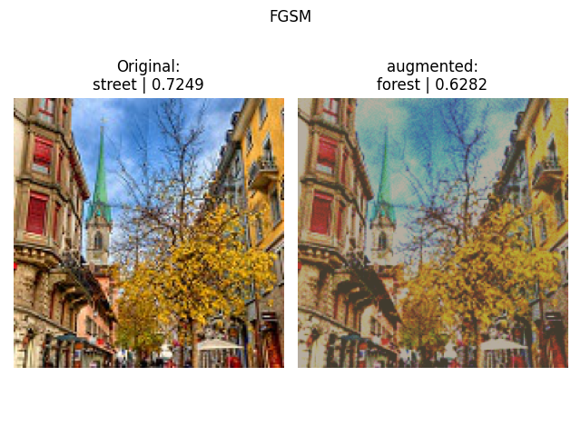
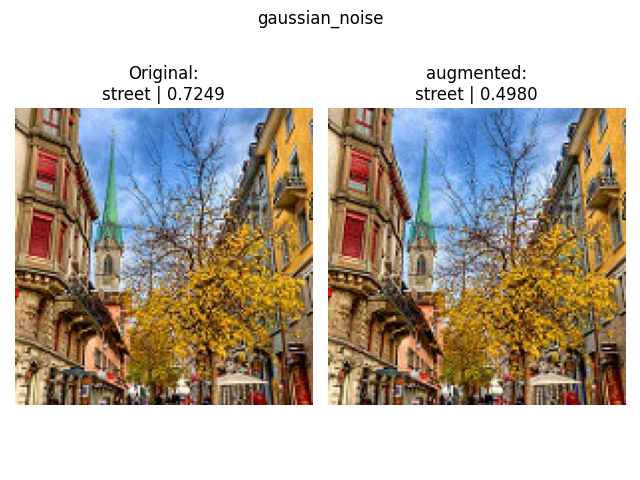
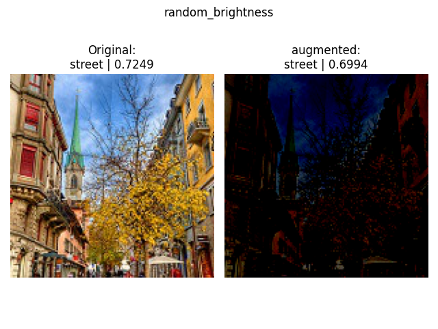

# Serverless Deployment

## Description

This demonstrates how to deploy a model in a serverless environment using AWS Lambda and API Gateway. The model is trained using the Intel Image Classification dataset, and the goal is to deploy it in a way that allows for easy scaling and cost efficiency.

## Prerequisites

- AWS CLI installed and configured
- AWS SAM CLI installed and configured
- Docker installed
- A trained model that you want to deploy
- The dependencies of your model must be packaged in a `requirements.txt` file

## Serverless Framework

https://www.serverless.com/

```bash
curl -sL https://deb.nodesource.com/setup_16.x | sudo -E bash -
```
```bash
sudo apt install nodejs
```

After pushing the docker image to the ECR,specify the image URI in the `serverless.yaml`

<details>
<summary><b>serverless.yaml:</b></summary>

```bash
service: serverless-intel
 
provider:
  name: aws #cloud provider
  region: ap-south-1 #region (mumbai)
  memorySize: 3008 #memory usage
  timeout: 300 
 
functions:
  intel: 
    image: 294495367161.dkr.ecr.ap-south-1.amazonaws.com/intel-serverless:latest
    events:
      - http:
          path: inference 
          method: post 
          cors: true
```
</details>
Make changes to the index_to_name.json 

<details>
<summary><b>index_to_name.json:</b></summary>

```bash
{
	"0": [
		"buildings"
	],
	"1": [
		"forest"
	],
	"2": [
		"glacier"
	],
	"3": [
		"mountain"
	],
	"4": [
		"sea"
	],
	"5": [
		"street"
	]
}
```
</details>

## Create the Docker image 

```bash
docker build -t intel-serverless
```
For testing it out 

```bash
docker run --rm -it -p 8080:8080 intel-serverless
```
After testing it out use the ECR to push the image to ECR using ECR Push Commands

Also make sure to add the Permissions to EC2 Role, it’ll be needed by serverless

```bash
AWSCloudFormationFullAccess
AmazonAPIGatewayAdministrator
CloudWatchLogsFullAccess
AWSLambda_FullAccess
AmazonS3FullAccess
```
## Deploy
```bash
serverless deploy
```

# Serverless FrontEnd

```bash
yarn create next-app --experimental-app
```

```bash
yarn dev
```

Open [http://localhost:3000](http://localhost:3000) with your browser to see the result.


#  Model Robustness 
[script](robustness.py)




